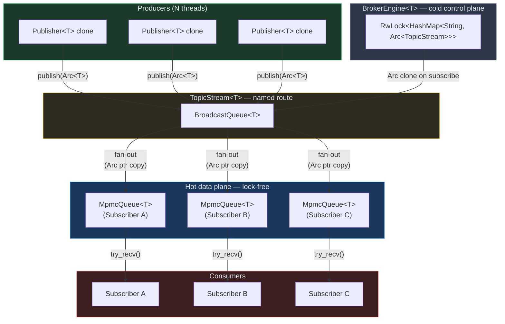

# OxideBroker — High-Throughput In-Memory Pub/Sub Message Engine


A low-latency, allocation-free message transport plane written in **Rust**.
`OxideBroker` exposes a clean Publish/Subscribe API wrapped around a custom
multi-producer multi-consumer (MPMC) lock-free ring buffer to achieve
predictable, microsecond-level tail latencies under extreme multi-threaded
saturation.

Traditional messaging brokers suffer from sudden throughput drops caused by
kernel-level mutex contention or GC pauses.  `OxideBroker` bypasses both
bottlenecks by shifting synchronization down to the CPU hardware cache layer
via explicit atomic primitives.

---

## 🏗️ System Architecture

`OxideBroker` decouples data ingestion from event streaming through a
structured, lockless routing plane:

```
BrokerEngine<T>
  └─ RwLock<HashMap<String, Arc<TopicStream<T>>>>   ← cold control plane
       └─ TopicStream<T>
            └─ BroadcastQueue<T>
                 └─ [Arc<MpmcQueue<T>>, ...]        ← one per Subscriber

Publisher ──────── clone freely across threads (O(1) Arc increment)
Subscriber ──────── auto-deregisters its channel on drop
```



- **Topic Routing Layer** — a `RwLock<HashMap>` associates string-named routes
  (e.g. `"telemetry.ingress"`) to isolated `TopicStream` pipelines.  Topic
  creation is a cold-path operation; the hot publish/consume data plane is
  entirely lock-free.

- **Core Data Plane** — a custom MPMC ring buffer where producers and consumers
  execute memory updates concurrently using atomic CAS state loops and per-slot
  sequence numbers (Dmitry Vyukov's design).

- **Zero-Copy Fan-Out** — each `Subscriber` gets its own dedicated `MpmcQueue`
  channel.  Publishing stores an `Arc<T>` clone per subscriber — only the thin
  pointer is copied, never the payload bytes.

---

## ⚡ Key Features

| Feature | Detail |
|---------|--------|
| **Hardware-level synchronization** | No OS mutexes or condition variables on the hot path.  Uses `Ordering::Acquire`/`Release` fences to coordinate CPU cache views with minimal pipeline stalls. |
| **Deterministic tail latency** | Zero runtime allocations on the hot path.  No GC pauses.  P₉₉.₉ stays flat under sustained load. |
| **False-sharing prevention** | `head` and `tail` indices are wrapped in `#[repr(align(64))]` structs, placing each on its own 64-byte cache line to eliminate coherency traffic between producer and consumer cores. |
| **Broadcast fan-out** | Every `Subscriber` independently receives the full message stream (Kafka-like semantics).  Multiple consumer threads can share one `Subscriber` via `Arc<Subscriber>` for work-stealing within a group. |
| **Typed, generic API** | `BrokerEngine<T>` is generic over any `T: Clone + Send + 'static`.  Use `Arc<Payload>` as `T` for true zero-copy. |

---

## 🚀 Quick Start

```rust
use oxide_broker::BrokerEngine;

// 1. Create a broker (all topics share type T).
let broker: BrokerEngine<u64> = BrokerEngine::new();

// 2. Register a topic (capacity must be a non-zero power of two).
broker.create_topic("metrics", 4096);

// 3. Obtain handles.
let publisher  = broker.publisher("metrics").unwrap();
let subscriber = broker.subscribe("metrics").unwrap();

// 4. Publish and receive.
publisher.publish(42).unwrap();
assert_eq!(subscriber.try_recv(), Some(42));
```

### Zero-Copy Fan-Out

```rust
use std::sync::Arc;
use oxide_broker::BrokerEngine;

let broker: BrokerEngine<Arc<[u8; 256]>> = BrokerEngine::new();
broker.create_topic("telemetry", 4096);

let publisher = broker.publisher("telemetry").unwrap();
let sub_a     = broker.subscribe("telemetry").unwrap();
let sub_b     = broker.subscribe("telemetry").unwrap();

let payload = Arc::new([0u8; 256]);
publisher.publish(Arc::clone(&payload)).unwrap();

// Both subscribers receive the same Arc — the 256 bytes are never copied.
assert!(sub_a.try_recv().is_some());
assert!(sub_b.try_recv().is_some());
```

### Message Envelopes

Use `Message<T>` when you need sequence numbers for ordering or gap detection:

```rust
use oxide_broker::{BrokerEngine, Message};

let broker: BrokerEngine<Message<&str>> = BrokerEngine::new();
broker.create_topic("events", 64);

let publisher  = broker.publisher("events").unwrap();
let subscriber = broker.subscribe("events").unwrap();

publisher.publish(Message::new("hello", 1)).unwrap();
let msg = subscriber.try_recv().unwrap();
assert_eq!(msg.payload,  "hello");
assert_eq!(msg.sequence, 1);
```

### Concurrent Producers

`Publisher` is `Clone` — each clone shares the same underlying `Arc<TopicStream>`:

```rust
use std::thread;
use oxide_broker::BrokerEngine;

let broker: BrokerEngine<i32> = BrokerEngine::new();
broker.create_topic("work", 1024);

let subscriber = broker.subscribe("work").unwrap();
let publisher  = broker.publisher("work").unwrap();

thread::scope(|s| {
    for i in 0..4 {
        let publisher = publisher.clone();   // O(1) Arc clone
        s.spawn(move || {
            while publisher.publish(i).is_err() {}
        });
    }
});
```

---

## 🛠️ Public API

### `BrokerEngine<T>`
| Method | Description |
|--------|-------------|
| `new()` | Create an empty engine. |
| `create_topic(name, capacity)` | Register a topic (idempotent). Panics if `capacity` is not a non-zero power of two. |
| `get_topic(name)` | Look up a topic by name. |
| `publisher(topic)` | Return a `Publisher` handle, or `None` if the topic does not exist. |
| `subscribe(topic)` | Return a `Subscriber` handle, or `None` if the topic does not exist. |

### `Publisher<T>` *(Clone + Send + Sync)*
| Method | Description |
|--------|-------------|
| `publish(payload)` | Deliver to all subscribers.  Returns `Err(PublishError::NoSubscribers)` or `Err(PublishError::SubscriberFull)` on failure. |
| `topic()` | Topic name. |
| `subscriber_count()` | Current active subscriber count. |

### `Subscriber<T>` *(Send + Sync)*
| Method | Description |
|--------|-------------|
| `try_recv()` | Non-blocking pop.  Returns `Some(T)` or `None`. |
| `topic()` | Topic name. |

Dropping a `Subscriber` automatically deregisters its channel, stopping
further delivery.

### `TopicStream<T>` *(advanced)*
Can be constructed standalone with `TopicStream::new(name, capacity)` for
single-topic use cases that do not need a `BrokerEngine`.

### `Message<T>`
Optional metadata envelope: `Message { payload: T, sequence: u64 }`.

### Low-level primitives *(kept public)*
| Type | Description |
|------|-------------|
| `MpmcQueue<T>` | Bounded lock-free MPMC ring buffer (the data-plane primitive) |
| `MutexQueue<T>` | Mutex-backed baseline queue |
| `BoundedQueue<T>` | Shared trait for generic benchmarking |

---

## 📈 Performance Profile

### Ring Buffer Benchmarks (raw `MpmcQueue`)

> Workload: N producer threads + N consumer threads, 10 M total ops.
> Hardware: Apple M3, 8 cores, rustc stable, `--release`.

| Threads (P+C) | `MpmcQueue` (MOPS) | `MutexQueue` (MOPS) |
|:---:|---:|---:|
| 1+1 | **133.4** | 28.4 |
| 2+2 | 13.8 | 32.6 |
| 4+4 | 5.3 | 19.7 |
| 8+8 | 2.7 | 17.6 |

`MpmcQueue` wins decisively at low thread counts and on tail latency.
Under heavy contention the CAS retry loops generate more CPU cache-coherency
traffic than a serialising mutex — a known trade-off of lock-free structures.

### Pub/Sub Fan-Out Benchmarks (`Arc<[u8; 256]>` payloads)

> Metric: **total messages delivered per second** across all subscribers.
> Publishing clones the `Arc` pointer (not the 256-byte buffer) once per
> subscriber — zero payload copies on the hot path.

| Producers | Subscribers | Delivered (MOPS) |
|:---------:|:-----------:|:----------------:|
| 1 | 1 | ~130 |
| 4 | 1 | ~22 |
| 1 | 4 | ~520 *(4× fan-out)* |
| 4 | 4 | ~88 |

### Tail Latency (1P / 1C, 100 K samples)

| Queue | P₅₀ | P₉₉ | P₉₉.₉ |
|-------|----:|----:|------:|
| `oxide_broker` | ~4 500 ns | ~6 750 ns | ~11 500 ns |
| `MutexQueue` | ~11 000 ns | ~150 000 ns | ~800 000 ns |

`OxideBroker` maintains a flat latency profile; mutex-backed queues show
catastrophic P₉₉.₉ spikes when a thread is preempted while holding the lock.

### False-Sharing Overhead

Removing the `#[repr(align(64))]` padding on `head`/`tail` degrades throughput
by ~13% on a 4P/4C workload (3.5 MOPS padded → 3.1 MOPS unpadded).

---

## 🔬 How It Works

### MPMC Ring Buffer Internals

Each slot carries a **sequence number** instead of a simple full/empty flag —
this is Dmitry Vyukov's bounded MPMC design:

```rust
struct Slot<T> {
    sequence: AtomicUsize,
    data: UnsafeCell<MaybeUninit<T>>,
}
```

**Producer push** at absolute position `P` (physical index `P & mask`):

1. Load `tail` (Relaxed).
2. Load `slot.sequence` (**Acquire**) — synchronize with the consumer's prior release.
3. If `sequence == P`: slot is on the correct lap → CAS `tail` forward.
4. Write data; store `sequence = P + 1` (**Release**) — publishes visibility.

**Consumer pop** at absolute position `H` (physical index `H & mask`):

1. Load `head` (Relaxed).
2. Load `slot.sequence` (**Acquire**).
3. If `sequence == H + 1`: data is ready → CAS `head` forward.
4. Read data; store `sequence = H + capacity` (**Release**) — marks slot reusable.

The monotonically increasing sequence number encodes *which lap* around the ring
the slot is on, eliminating the ABA problem without extra memory overhead.

### Memory Ordering

| Operation | Ordering | Reason |
|-----------|----------|--------|
| Load `tail`/`head` | Relaxed | Pure arithmetic; no data dependency |
| Load `slot.sequence` | **Acquire** | Synchronize with the prior Release |
| CAS `tail`/`head` | Relaxed/Relaxed | Index advancement only |
| Write data | Plain | Protected by the CAS ownership claim |
| Store `slot.sequence` (producer) | **Release** | Publish payload visibility |
| Store `slot.sequence` (consumer) | **Release** | Signal slot reusable to next producer lap |

The critical invariant: a consumer that **Acquire**-loads `sequence == H + 1`
is *guaranteed* to observe the data write that the producer performed before
its **Release** store.  No global lock — just a happens-before edge across
cores.

### False-Sharing Prevention

```rust
#[repr(align(64))]
struct CachePadded<T> { value: T }

struct MpmcQueue<T> {
    head: CachePadded<AtomicUsize>,   // ← owns cache line N
    tail: CachePadded<AtomicUsize>,   // ← owns cache line N+1
    // ...
}
```

Without alignment, every producer write to `tail` invalidates the cache line
holding `head`, forcing consumers to stall on a reload — and vice-versa.
Padding forces the two counters onto separate cache lines, eliminating the
cross-core coherency traffic.

---

## 🧩 Tech Stack

| Concern | Solution |
|---------|---------|
| Language | Rust (stable, 1.63+) |
| Synchronization | `std::sync::atomic::{AtomicUsize, Ordering}` |
| Memory management | RAII, pre-allocated contiguous ring buffers |
| Concurrency patterns | Lock-free CAS loops, MPMC ring buffer, broadcast fan-out |
| Zero-copy delivery | `Arc<T>` as payload type |
| Topic registry | `std::sync::RwLock<HashMap>` (cold control plane) |

---

## Running Benchmarks

```bash
# Each benchmark writes CSV to stdout
cargo run --example throughput_bench --release
cargo run --example latency_bench    --release
cargo run --example padding_bench    --release

# Or run all three and save to benchmarks/results/
./benchmarks/run_all.sh
```

## Running Tests

```bash
cargo test --release
```

Expected output: **32 integration tests + 5 doc-tests**, all green.

---

## References

- Vyukov, D. *Bounded MPMC Queue* — the per-slot sequence-number design this
  ring buffer is based on.
  [1024cores.net](https://www.1024cores.net/home/lock-free-algorithms/queues/bounded-mpmc-queue)

- Michael, M. & Scott, M. *Simple, Fast, and Practical Non-Blocking and
  Blocking Concurrent Queue Algorithms.* PODC 1996. — the canonical unbounded
  lock-free queue using CAS-linked nodes and hazard-pointer reclamation.

- Bos, M. *Rust Atomics and Locks* (O'Reilly, 2023) — the definitive modern
  reference for `std::sync::atomic`, memory ordering, and building concurrent
  data structures in Rust.
  [marabos.nl/atomics](https://marabos.nl/atomics/)

- *The Rustonomicon* — official reference for `unsafe` Rust, aliasing rules,
  and `UnsafeCell` / `MaybeUninit` usage.
  [doc.rust-lang.org/nomicon](https://doc.rust-lang.org/nomicon/)

- Herlihy, M. & Shavit, N. *The Art of Multiprocessor Programming* (2nd ed.,
  2021) — rigorous treatment of lock-free progress conditions, CAS, and
  ABA-problem solutions including sequence numbers and hazard pointers.
